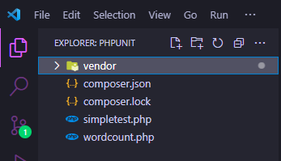

# Halo namaku Yuwandana dari prodi TIF22 BWS

Disini kita akan mencoba menghitung jumlah kata menggunakan #PHPUNIT
nah ada beberapa langkah nih untuk mencobanya:

1. Pastikan sudah menginstal composer
2. buat folder dengan nama bebas di dalam htdocs dan jika menggunakan laragon bisa buat folder didalam www
3. lakukan penginstalan phpunit dengan terminal lalu jalankan perintah: 

   composer require --dev phpunit/phpunit

4. Jika Instalasi sudah selesai pastikan menambah 2 file atau copy kode diatas dan taruh diluar folder vendor dan pastikan nama file sama!

   
   
5. lalu jalankan perintah:

   ./vendor/bin/phpunit --bootstrap vendor/autoload.php simpletest.php

6. jika tampil 1 test ok maka berhasil

   

   // SELAMAT MENCOBA TEMAN-TEMAN  //
